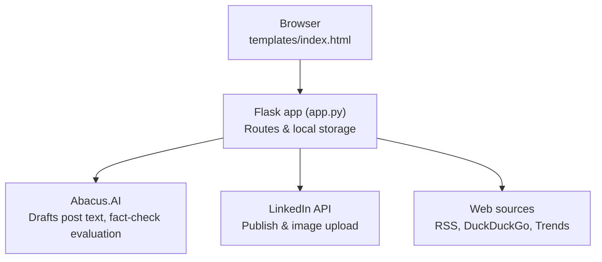

# LinkedIn AI Post Studio — Product Documentation

**Version:** 3.0
**Last Updated:** July 2026
**Status:** Active Development

---

## 1. Overview

LinkedIn AI Post Studio is a local Python web application that automates personal-brand content creation and publishing on LinkedIn. It aggregates fresh industry news across multiple domains, uses an LLM to draft contextually relevant posts, fact-checks them against live web evidence, and publishes them directly to LinkedIn via the official versioned REST API — with image attachment support throughout.

The app runs entirely on the user's machine (`python app.py`) and is accessed via browser at `http://localhost:5001`. No cloud hosting, external database, or background service is required — every action is triggered directly by the user in the browser.

---

## 2. Problem Statement

Maintaining a consistent LinkedIn presence requires:
- Staying on top of fast-moving news across multiple domains simultaneously
- Writing engaging posts in a consistent voice — repeatedly, multiple times per week
- Verifying that AI-drafted claims are actually accurate before publishing them publicly
- Tracking what has already been posted to avoid duplication

Doing this manually is time-consuming and inconsistent. This tool collapses the core workflow — research → draft → fact-check → review → publish — into a single interface.

---

## 3. Target User

A working professional or researcher who wants to build a LinkedIn personal brand across one or more of the following domains:

- AI & Machine Learning
- Chemistry, Chemoinformatics & Computational Science
- Pharma & Drug Discovery
- Patents, IP & Legal
- Cybersecurity & InfoSec
- Cloud Computing (AWS, Azure, GCP)
- Governance, Risk & Compliance (GRC)

---

## 4. Core Features

### 4.1 Trend Fetching (Step 1 — Fetch)
- Fetches fresh news from the past 7 days using DuckDuckGo web search + 50+ curated RSS feeds
- Optional: Google Trends integration (rising queries by region) and Twitter/X public posts via DDG
- Domain-aware: selecting a category pill automatically routes to the correct RSS feeds and search queries
- Seen-articles cache: articles already shown are suppressed for 30 days; user can clear the cache at any time from the Fetch screen
- Output: list of topic cards showing headline, summary, relevance note ("why it matters"), and heat level (hot / rising / new)

### 4.2 Topic Selection (Step 2 — Pick)
- User multi-selects which topics to draft posts for
- Each card shows source, heat indicator, and the LLM-generated "why it matters" note

### 4.3 Post Review & Editing (Step 3 — Review)
- LLM drafts a post for each selected topic
- User edits the text inline before approving
- AI-generated hashtag pills — click to append to the post
- **Fact Check** — verifies the post's factual claims against live web evidence (see §4.6)
- **Image upload** — drag & drop or click to attach a JPG/PNG (max 10MB); uploaded to LinkedIn's Images API and attached to the post at publish time
- Per-post verdict: **Approve** or **Reject**
- **Regenerate** — re-drafts a post without refetching trends

### 4.4 Publishing (Step 4 — Publish)
- Publishes all approved posts to LinkedIn in one click
- Supports text-only and image+text posts
- Shows the real LinkedIn error (token, scope, or content issue) inline per post if publishing fails
- "Copy all approved posts to clipboard" and "Open LinkedIn in browser" utility actions

### 4.5 Custom Topic Search
- User types any topic → app scrapes news + ArXiv research papers
- Selects sources → LLM drafts a post based on the chosen source material
- Supports angle/focus customization and all tone/length options
- Same Fact Check and image drag-and-drop capabilities as the Step 3 review flow
- Publishes directly to LinkedIn from this screen — no need to route through Steps 1–4

### 4.6 Fact Checker
Available on every draft (Step 3 review cards and the Custom Topic draft panel) via the **"🔍 Fact Check"** button. It:
1. Extracts the 3–5 most important verifiable claims from the post (statistics, names, dates, events — not opinions)
2. Searches DuckDuckGo for live, current evidence for each claim
3. Asks the LLM to evaluate each claim against that live evidence (not its training data)

Results render inline below the editor: an overall accuracy score (0–100) and verdict, plus each claim tagged **Verified** (green), **Uncertain** (yellow), or **Likely false** (red) with a one-line explanation and up to 2 source links.

### 4.7 Image Attachment
Both the Step 3 review cards and the Custom Topic draft panel include a drag-and-drop drop zone (click or drag a JPG/PNG, max 10MB). The image is held client-side with a live preview until the post is published, at which point it's uploaded to LinkedIn's Images API (`/rest/images`) and attached to the post via `content.media.id` in the Posts API payload.

### 4.8 Debug Tool
- `/api/debug-publish` validates the LinkedIn token and URN format, confirms the token matches the URN, and test-publishes a throwaway post — reporting the exact failure reason at whichever step breaks.

---

## 5. Content Domain Coverage

### RSS Feeds & Category Pills

| Domain | Categories | Key Sources |
|--------|-----------|-------------|
| AI & Technology | 8 categories | TechCrunch AI, The Verge, VentureBeat, MIT Tech Review, Wired, ArXiv CS.AI/LG |
| Chemistry & Computational Science | 5 categories | C&EN, RSC News, Nature Chemistry, ChemRxiv, J. Chem. Inf. (ACS), ArXiv Chemistry |
| Pharma & Life Sciences | 4 categories | FiercePharma, BioPharma Dive, STAT News, Nature Drug Discovery, FDA/EMA |
| Patents, IP & Legal | 3 categories | IPWatchdog, Patent Docs, Managing IP, IP Watch, Law360 IP |
| Cybersecurity | 5 categories | Krebs on Security, The Hacker News, BleepingComputer, Dark Reading, SecurityWeek, SANS ISC, ArXiv CS.CR |
| Cloud — AWS · Azure · GCP | 6 categories | AWS News, Azure Updates, GCP Blog, The New Stack, InfoQ Cloud, Cloud Security Alliance, ArXiv CS.NI |
| GRC | 4 categories | ISACA, IAPP, Risk.net, Compliance Week, NIST |

**Total: 7 domain groups · 35 category pills · 50+ RSS feeds**

---

## 6. Technical Architecture

### Stack
- **Backend:** Python 3.10+, Flask 3.x
- **Frontend:** Single-page HTML/CSS/JS (`templates/index.html`) — no framework, no build step
- **LLM:** Abacus.AI RouteLLM API (OpenAI-compatible `/v1/chat/completions`)
- **Web search:** DuckDuckGo via the `ddgs` library (no API key required)
- **RSS parsing:** Python standard library `xml.etree.ElementTree`
- **LinkedIn API:** versioned REST API — `/rest/posts` (publish), `/rest/images` (image upload)

### Request Flow

The browser only ever talks to the local Flask app; Flask is the only component that talks to the outside world. Every action (fetching, drafting, fact-checking, publishing) is a direct, user-initiated request — there is no background process running between user actions.

### Data Storage
| File | Contents |
|------|----------|
| `seen_articles.json` | Article titles and URLs with timestamps (30-day TTL), used to suppress repeat trend results |

This file is created automatically on first run in the working directory. There is no persistent store of drafted or published post content — the browser holds post state in memory for the current session only.

### LLM Calls Per Session
| Task | Max Tokens |
|------|-----------|
| Trend extraction | 3000 |
| Post drafting (trend-based or custom topic) | 1500 |
| Hashtag generation | 80 |
| Fact-check claim extraction | 400 |
| Fact-check evidence evaluation | 1500 |

---

## 7. Configuration (.env)

| Variable | Required | Default | Description |
|----------|----------|---------|-------------|
| `ABACUS_API_KEY` | ✅ Yes | — | Abacus.AI API key |
| `ABACUS_BASE_URL` | No | `https://routellm.abacus.ai/v1` | RouteLLM endpoint |
| `ABACUS_MODEL` | No | `route-llm` | LLM model ID |
| `LINKEDIN_TOKEN` | ✅ Yes | — | 60-day OAuth token |
| `LINKEDIN_URN` | ✅ Yes | — | `urn:li:person:XXXXXXXX` |

`LINKEDIN_API_VERSION` (currently `202507`) is set directly in `app.py`, not `.env` — see §10.

---

## 8. API Endpoints

| Method | Endpoint | Description |
|--------|----------|-------------|
| GET | `/` | Main app UI |
| GET | `/api/key-check` | Verify Abacus API key is configured |
| GET | `/api/li-prefill` | Return saved LinkedIn credentials from `.env` |
| GET | `/api/sources-status` | Check optional source (DDG, pytrends) availability |
| GET | `/api/seen-cache-info` | Count cached articles |
| POST | `/api/clear-seen-cache` | Reset seen-articles cache |
| POST | `/api/fetch-trends` | Fetch and LLM-process trends |
| POST | `/api/draft-post` | Draft a single post from a trend |
| POST | `/api/search-topic` | Custom topic search (news + research) |
| POST | `/api/draft-from-topic` | Draft from selected custom-topic sources |
| POST | `/api/upload-image` | Upload image to LinkedIn, returns asset URN |
| POST | `/api/publish` | Publish post (optionally with image) to LinkedIn |
| POST | `/api/debug-publish` | Validate credentials + test publish |
| POST | `/api/fact-check` | Extract claims and evaluate them against live web evidence |

---

## 9. LinkedIn OAuth Scopes

| Scope | Purpose | Available |
|-------|---------|-----------|
| `openid` | Identity verification | ✅ Standard |
| `profile` | Member name and URN | ✅ Standard |
| `email` | Email address | ✅ Standard |
| `w_member_social` | Publish posts, upload images | ✅ Standard |

No elevated or partner-only scopes are required — every feature in the app works with a standard LinkedIn developer app approved for "Share on LinkedIn."

---

## 10. LinkedIn API Version

The app calls LinkedIn's versioned REST API and sends a `LinkedIn-Version: YYYYMM` header (currently `202507`, set once in `app.py` as `LINKEDIN_API_VERSION`). LinkedIn keeps roughly the last 12 months of versions active; requests using an expired version return `426 NONEXISTENT_VERSION`. When that happens, bump `LINKEDIN_API_VERSION` in `app.py` to a recent `YYYYMM` value and restart the app.

---

## 11. Known Limitations

| Limitation | Reason |
|-----------|--------|
| Token expires every 60 days | LinkedIn policy — must be regenerated manually via the OAuth 2.0 tools page |
| AI image generation not available | External image-generation APIs now require paid subscriptions; the app only supports user-supplied images |
| Google Trends optional | `pytrends` can be unreliable; disabled by default |
| No post history or scheduling | Removed by design — the app is single-session and publish-only; nothing runs in the background between visits |
| Post state is in-memory only | Refreshing the browser mid-session loses unpublished drafts; there is no server-side persistence of draft/post content |

---

## 12. Out of Scope

- AI-generated images
- Multi-account LinkedIn support
- Company page posting
- Post scheduling / calendar view
- Post-performance analytics (impressions, engagement, etc.)
- Mobile app or hosted/SaaS version
