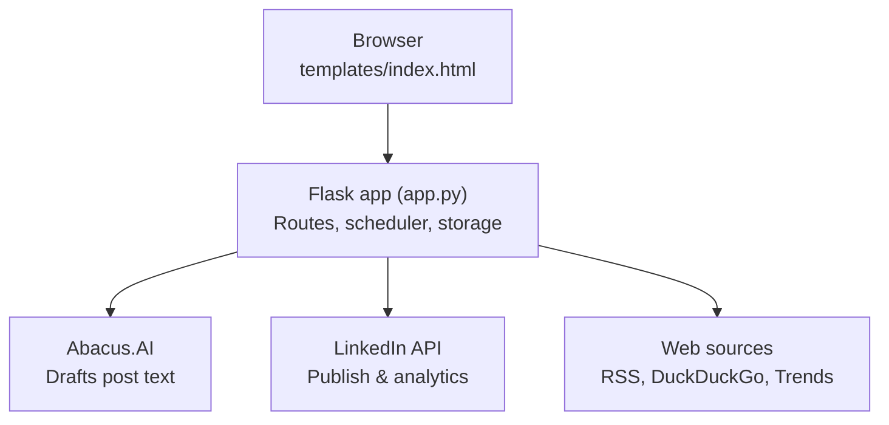

# LinkedIn AI Post Studio

A locally-run web app that helps you research industry trends, write LinkedIn posts with AI, fact-check them against live web sources, and publish or schedule them — all from your browser.

You run it on your own computer. Nothing is hosted, nothing is sent to a third-party service except the Abacus.AI API (for text generation) and LinkedIn's API (for publishing).

---

## What it does

You open the app in your browser, pick the topics you care about (AI, pharma, cybersecurity, cloud, etc.), and click one button to fetch the latest news from across the web. The app pulls articles from DuckDuckGo searches, 50+ RSS feeds, and optionally Google Trends. It then uses Abacus.AI to turn the freshest stories into draft LinkedIn posts, ready to edit and publish.

From there you can:

- Edit the draft directly in the browser
- **Fact-check the post against live web results before publishing**
- Add an image
- Click to add suggested hashtags
- Publish immediately to LinkedIn
- Or schedule it for a specific date and time — the app will auto-publish in the background

There is also a calendar view, post analytics (impressions, likes, engagement rate), and a custom topic search if you want to research something specific rather than browse general trends.

---

## Architecture

Everything runs on your own machine. The browser only talks to the local Flask app, which is the one thing that talks to the outside world.



- **Browser** — the entire frontend, one HTML file, no build step.
- **Flask app** — the backend: API routes, the scheduler that auto-publishes, and local JSON storage.
- **Abacus.AI** — drafts and rewrites post text.
- **LinkedIn API** — publishing, image uploads, and analytics.
- **Web sources** — RSS feeds, DuckDuckGo, and Google Trends for trend data.

---

## Fact checker

Every draft has a **"Fact Check"** button. Clicking it:

1. Extracts the 3–5 key verifiable claims from your post (statistics, names, dates, events — not opinions)
2. Searches DuckDuckGo for real, current sources for each claim
3. Asks the AI to evaluate each claim against those live search results — not its training data

Results appear inline below the editor. Each claim is classified and color-coded:

| Color | Status | Meaning |
|-------|--------|---------|
| Green | Verified | Live web evidence supports the claim |
| Yellow | Uncertain | Evidence is weak, missing, or ambiguous |
| Red | Likely false | Live evidence contradicts the claim |

An overall accuracy score (0–100) and verdict are shown at the top, along with clickable source links for each claim.

The fact checker is available in both the Step 3 review cards and the Custom Topic draft panel.

---

## What you need before starting

**Abacus.AI account**

Abacus.AI is the service that generates the post text. It gives you access to multiple large language models (including Claude, GPT-4o, Gemini, and others) through a single API key.

1. Go to [abacus.ai/app/route-llm-apis](https://abacus.ai/app/route-llm-apis)
2. Sign up for a ChatLLM subscription (around $10/month)
3. Copy your API key — you will paste it into the `.env` file

**LinkedIn access token and member URN**

This is what allows the app to post on your behalf.

1. Go to [linkedin.com/developers](https://www.linkedin.com/developers/)
2. Click "Create app" — you will need to link it to a LinkedIn company page (you can create a personal brand page if you do not have one)
3. Under the "Products" tab, request access to "Share on LinkedIn"
4. Once approved, go to the "Auth" tab, then "OAuth 2.0 tools"
5. Generate a token with these scopes checked: `openid`, `profile`, `email`, `w_member_social`
6. Copy the token — this is your `LINKEDIN_TOKEN`
7. Your member URN looks like `urn:li:person:AbCdEfGh` — you can find it in the token response or by checking your profile URL

> Tokens expire after 60 days. When a post fails with a 401 error, it means the token has expired. Go back to the OAuth tools page and generate a new one.

---

## Installation

If you have never used Python before, follow these steps exactly. If you are comfortable with Python, skip to step 3.

**Step 1 — Make sure Python is installed**

Open Terminal (on Mac) or Command Prompt (on Windows) and run:

```
python --version
```

You should see something like `Python 3.10.x` or higher. If you get an error, download Python from [python.org](https://www.python.org/downloads/) and install it.

**Step 2 — Download the project**

If you have Git installed:

```bash
git clone <your-repo-url>
cd linkedin_studio_exe_pkg
```

Or download the ZIP from GitHub and unzip it, then open Terminal in that folder.

**Step 3 — Install dependencies**

```bash
pip install -r requirements.txt
```

This installs Flask (the web server), APScheduler (background scheduling), and a few other packages. It takes about a minute.

**Step 4 — Create your `.env` file**

Copy the example file:

```bash
cp .env.example .env
```

Open `.env` in any text editor (Notepad, TextEdit, VS Code) and fill in your values:

```
ABACUS_API_KEY=paste_your_abacus_key_here
LINKEDIN_TOKEN=paste_your_linkedin_token_here
LINKEDIN_URN=urn:li:person:paste_your_urn_here
```

Save the file. Do not share this file or commit it to Git — it contains your private credentials.

**Step 5 — Run the app**

```bash
python app.py
```

You will see a message in Terminal confirming it started. Open your browser and go to:

```
http://localhost:5001
```

---

## Using the app

The app works in four steps, shown as tabs across the top.

**Step 1 — Fetch**

Choose the topic categories you want news about (for example, "AI models & releases" or "Cybersecurity news"). Set your preferred tone, post length, and how many topics to fetch. Then click "Fetch latest AI trends."

The app searches the web, reads RSS feeds, and asks the AI to identify the most relevant recent stories. This takes 20–40 seconds depending on how many categories you selected.

**Step 2 — Pick**

You will see a list of trend cards. Each one shows the headline, a short summary, why it matters, and a heat label (hot, rising, or new). Click any card to select it. Select as many as you want to turn into posts.

**Step 3 — Review**

The app drafts a LinkedIn post for each topic you selected. You can edit the text directly, add an image, click hashtags to append them, and then:

- Click **"Fact Check"** to verify the post's claims against live web results before publishing
- Click **"Approve"** to mark the post ready to publish now
- Click **"Schedule"** to pick a date and time for auto-publishing
- Click **"Reject"** to skip that post

**Step 4 — Publish**

A summary shows how many posts are approved and scheduled. Click "Publish all approved posts" to send them to LinkedIn immediately. Scheduled posts will auto-publish at their set time as long as the app is running.

**Custom topic search**

Click "Custom topic" in the top navigation if you want to research a specific subject rather than browse trending news. Enter any topic (for example, "AI in radiology" or "zero-trust security"), choose whether to search news, research papers, or both, and the app will find relevant sources. You can then pick which sources to include and generate a post from them. A Fact Check button is available here too before you publish.

**Analytics**

Click "Analytics" to see performance data (impressions, clicks, likes, engagement rate) for posts you have published through the app. This requires the `r_member_social` scope on your LinkedIn token — see the note in the Troubleshooting section.

**Calendar**

The Calendar tab shows all your scheduled, published, and failed posts in a monthly grid. You can publish a scheduled post early, reschedule it, or delete it from here.

---

## Keeping the app running for scheduled posts

Scheduled posts only auto-publish while the app is running. If you close Terminal or shut down your computer, the scheduler stops. When you start the app again, any overdue scheduled posts will publish immediately on the next scheduler check (within one minute).

If you want the app to run continuously in the background, you can look into running it as a background process or a service — but for personal use, simply leaving the Terminal window open is sufficient.

---

## Configuration reference

All configuration is done through the `.env` file.

| Variable | Required | Default | Description |
|----------|----------|---------|-------------|
| `ABACUS_API_KEY` | Yes | — | Your API key from abacus.ai |
| `ABACUS_BASE_URL` | No | `https://routellm.abacus.ai/v1` | Change only if you are on an Abacus enterprise plan |
| `ABACUS_MODEL` | No | `route-llm` | The model used for drafting. `route-llm` auto-selects the best available model. You can also specify `claude-sonnet-4-6`, `gpt-4o`, `gemini-2.5-flash`, etc. |
| `LINKEDIN_TOKEN` | Yes | — | Your LinkedIn OAuth token. Expires every 60 days |
| `LINKEDIN_URN` | Yes | — | Your LinkedIn member URN, e.g. `urn:li:person:AbCdEfGh` |

---

## Domain and topic coverage

The following topic categories are available as pills in the Fetch tab. Each maps to a curated set of RSS feeds and search queries.

| Domain | Categories |
|--------|-----------|
| AI & Technology | AI models & releases, AI tools & products, AI industry news, AI research papers, AI policy & regulation, AI startups & funding, Prompt engineering, AI in business |
| Chemistry & Computational Science | Chemistry news, Chemical research papers, Chemoinformatics, Computational chemistry, Drug discovery |
| Pharma & Life Sciences | Pharma news, Pharma research, Clinical trials, Regulatory & FDA |
| Patents, IP & Legal | Patents, IP & intellectual property, Legal & compliance |
| Cybersecurity | Cybersecurity news, Cyber threats & attacks, Security research, Vulnerability & CVE, AI & cybersecurity |
| Cloud — AWS / Azure / GCP | AWS news, Azure news, GCP news, Cloud security, Cloud storage & infra, Cloud computing |
| GRC | GRC news, Governance & risk, Data privacy & compliance, NIST & frameworks |

---

## LinkedIn scopes explained

| Scope | What it is used for |
|-------|---------------------|
| `w_member_social` | Publishing posts and uploading images |
| `openid`, `profile`, `email` | Verifying your identity and retrieving your member URN |
| `r_member_social` | Reading analytics (impressions, likes, engagement rate) |

The analytics feature requires `r_member_social`. LinkedIn only grants this scope to apps approved under their Marketing Developer Platform, which requires a formal application. For standard developer accounts, the analytics tab will return an access denied error — this is a LinkedIn policy restriction, not a bug in the app.

---

## LinkedIn API version

The app calls LinkedIn's versioned REST API (`/rest/posts` for publishing, `/rest/images` for image uploads, `/rest/memberCreatorPostAnalytics` for analytics). Every request sends a `LinkedIn-Version: YYYYMM` header, set once in `app.py` as `LINKEDIN_API_VERSION`.

LinkedIn only keeps roughly the last 12 months of versions active — older ones start returning a `426 NONEXISTENT_VERSION` error. If publishing, image uploads, or analytics suddenly all fail at once with that error, the version has expired and needs bumping:

1. Open `app.py` and find `LINKEDIN_API_VERSION = "..."` near the top.
2. Update it to a recent `YYYYMM` value (e.g. the current or previous month).
3. Restart the app.

---

## Troubleshooting

**The warning banner says "ABACUS_API_KEY not set"**

Open your `.env` file and make sure `ABACUS_API_KEY=` has a value after the equals sign with no spaces. Save the file and restart the app.

**LinkedIn 401 error when publishing**

Your token has expired. Go to [linkedin.com/developers](https://www.linkedin.com/developers/), open your app, go to "Auth" then "OAuth 2.0 tools", and generate a new token. Update `LINKEDIN_TOKEN` in your `.env` file and restart the app.

**LinkedIn 403 error when publishing**

Your token does not have the `w_member_social` scope. Regenerate the token and make sure that scope is checked.

**LinkedIn 422 Duplicate post error**

LinkedIn prevents posting the same text twice in a short window. Edit the post text slightly before trying again.

**LinkedIn 426 "NONEXISTENT_VERSION" error, or publishing/image upload fails with no clear reason**

The `LINKEDIN_API_VERSION` value in `app.py` has expired — see [LinkedIn API version](#linkedin-api-version) above for how to update it.

**"Publishing failed" with no detail**

The Publish tab now shows the real error returned by LinkedIn (token, scope, version, or content issue) instead of a generic message. Check the text next to the failed post, or hover over its status for the full error.

**LinkedIn 403 on the Analytics tab**

This requires the `r_member_social` scope. Standard developer accounts do not have access to this scope — it requires LinkedIn Marketing Developer Platform approval.

**Fetch returns no results or "all articles already shown"**

Click "Clear seen cache" below the Fetch button. The app suppresses articles it has already shown you for 30 days — clearing the cache lets them appear again.

**DuckDuckGo returns no results**

DuckDuckGo may have rate-limited the app temporarily. Wait a minute and try fetching again. The fact checker also uses DuckDuckGo — if web search is rate-limited, fact-check results may show claims as "uncertain" even if they are accurate.

**Port 5001 is already in use**

Another application is using that port. Open `app.py`, scroll to the last line, and change `port=5001` to any other number (e.g. `port=5002`). Then access the app at `http://localhost:5002`.

**Scheduled posts did not publish**

Make sure the app was running at the time the post was scheduled. If it was not, restart the app — any overdue posts will be published within one minute.

---

## Project structure

```
linkedin_studio_exe_pkg/
    app.py                  Main application — all routes, scheduling, and API calls
    templates/
        index.html          The entire frontend — one self-contained HTML file
    requirements.txt        Python packages to install
    .env                    Your credentials (create this from .env.example)
    .env.example            Template showing what goes in .env
    schedule.json           Created automatically — stores your post schedule and history
    seen_articles.json      Created automatically — tracks articles already shown to you
```

---

## Dependencies

| Package | What it does |
|---------|-------------|
| `flask` | Runs the local web server |
| `requests` | Makes HTTP calls to Abacus.AI and LinkedIn |
| `python-dotenv` | Reads your `.env` file |
| `APScheduler` | Runs the background scheduler that auto-publishes posts |
| `ddgs` | Searches DuckDuckGo for recent news and fact-check evidence |
| `pytrends` | Fetches Google Trends data (optional — only needed if you enable the Trends toggle) |

---

## License

MIT. Free to use for personal and commercial purposes. Your use of the LinkedIn API is subject to [LinkedIn's API Terms of Service](https://legal.linkedin.com/api-terms-of-use).
