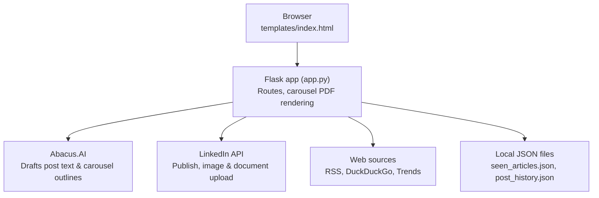

# LinkedIn AI Post Studio

A locally-run web app that helps you research industry trends, write LinkedIn posts with AI, fact-check them against live web sources, optimize them for search and AI answer engines, build PDF carousels, and publish them — all from your browser.

Drafts are written against how LinkedIn currently ranks content (Interest Graph + Depth Score), and the app tracks your posting cadence so you do not cannibalize your own reach.

You run it on your own computer. Nothing is hosted, nothing is sent to a third-party service except the Abacus.AI API (for text generation) and LinkedIn's API (for publishing).

---
## What it does

You open the app in your browser, pick the topics you care about (AI, pharma, cybersecurity, cloud, etc.), and click one button to fetch the latest news from across the web. The app pulls articles from DuckDuckGo searches, 50+ RSS feeds, and optionally Google Trends. It then uses Abacus.AI to turn the freshest stories into draft LinkedIn posts, ready to edit and publish.

From there you can:

- Edit the draft directly in the browser
- **Fact-check the post against live web results before publishing**
- **Optionally optimize the draft and hashtags for search + AI answer engines (SEO / AEO), and score any post 0–100**
- **Draft a Document post (PDF carousel) instead of plain text — the app writes the slide outline, renders the PDF, and publishes it to LinkedIn**
- Add an image (drag & drop or click to upload)
- Click to add suggested hashtags
- Publish immediately to LinkedIn

The app also warns you inline when a draft contains a link (LinkedIn penalizes those), and warns you when your posting cadence or topic mix is working against you.

There is also a custom topic search if you want to research something specific rather than browse general trends.

---

## Architecture

Everything runs on your own machine. The browser only talks to the local Flask app, which is the one thing that talks to the outside world.


```mermaid
flowchart TB
    Browser["Browser<br/>templates/index.html"]
    Flask["Flask app (app.py)<br/>Routes, carousel PDF rendering"]
    Abacus["Abacus.AI<br/>Drafts post text &amp; carousel outlines"]
    LinkedIn["LinkedIn API<br/>Publish, image &amp; document upload"]
    Web["Web sources<br/>RSS, DuckDuckGo, Trends"]
    Store["Local JSON files<br/>seen_articles.json, post_history.json"]

    Browser --> Flask
    Flask --> Abacus
    Flask --> LinkedIn
    Flask --> Web
    Flask --> Store
```

- **Browser** — the entire frontend, one HTML file, no build step.
- **Flask app** — the backend: API routes, carousel PDF rendering (Pillow), and local JSON storage.
- **Abacus.AI** — drafts and rewrites post text and carousel outlines.
- **LinkedIn API** — publishing, image uploads, and document (carousel) uploads.
- **Web sources** — RSS feeds, DuckDuckGo, and Google Trends for trend data.
- **Local JSON files** — `seen_articles.json` (articles already shown to you) and `post_history.json` (what you published and when, for cadence tracking). Both stay on your machine.

---

## Fact checker

Every draft has a **"Fact Check"** button. Clicking it:

1. Extracts the 3–5 key verifiable claims from your post (statistics, names, dates, events — not opinions)
2. Searches DuckDuckGo for real, current sources for each claim
3. Asks the AI to evaluate each claim against those live search results — not its training data

Results appear inline below the editor. Each claim is classified and color-coded:

| Color | Status | Meaning |
|-------|--------|---------|
| Green | Verified | Live web evidence supports the claim |
| Yellow | Uncertain | Evidence is weak, missing, or ambiguous |
| Red | Likely false | Live evidence contradicts the claim |

An overall accuracy score (0–100) and verdict are shown at the top, along with clickable source links for each claim.

The fact checker is available in both the Step 3 review cards and the Custom Topic draft panel.

---

## SEO / AEO optimization

An optional **SEO / AEO optimization** toggle is available in both the main flow (Step 1 settings) and the Custom Topic panel. It is **off by default** — when off, drafts and hashtags are generated exactly as before, so nothing existing changes.

When you turn it **on** (and optionally enter a primary keyword/phrase):

- **Search-friendly drafts** — the AI leads the hook with your keyword, weaves it in naturally 2–3 times, keeps claims specific (numbers, dates, named entities), and includes one self-contained sentence that AI answer engines (ChatGPT, Perplexity, Google AI Overviews) can quote verbatim.
- **Search-tuned hashtags** — hashtag suggestions are biased toward higher-reach, discoverable tags, including one built from your keyword.

Every draft also has an **"AEO Score"** button (next to Fact Check) that rates the post 0–100 on four dimensions — **keyword presence, quotability, claim clarity, and structure** — and returns concrete suggestions to improve it. It works whether or not the toggle was on when drafting.

> AEO (Answer Engine Optimization) targets how LinkedIn posts get surfaced and cited by AI answer engines, in addition to classic search. Because this app runs locally, this optimizes the **content it generates for LinkedIn** — there is no public website to crawl.

---

## How drafts are written for LinkedIn's current ranking

Every draft — standard or carousel, main flow or custom topic — is written against how LinkedIn ranks content today: an **Interest Graph** (posts are matched to readers by topic history, not just your network) and a **Depth Score** (dwell time, saves, and long comments count for more than likes). The rules baked into every prompt:

| Rule | Why |
|------|-----|
| Hyper-specific first 1–2 lines | A small sample of readers sees the post first. If they scroll past, distribution is capped permanently — the "Golden Hour" test |
| One idea per short paragraph, a concrete takeaway, at least one quotable standalone sentence | Optimizes for dwell time and depth rather than quick reactions |
| Ends with a specific question that needs a real answer | Long, considered comments outrank "Agree?" reactions |
| No URLs in the body, and never "link in comments" | A link in the first comment is penalized the same as one in the post |
| Stays on one tight topic/angle | Topic-scattering confuses interest matching and caps distribution |

**Link warning.** If a draft (or an edit you type) contains a URL, a red warning appears under the editor immediately, and the publish response flags it too. Nothing is blocked — it is your call.

**Golden Hour reminder.** After a successful publish, the app reminds you to reply to every comment within the next two hours, which is what pushes a post past its first sample audience.

---

## Document posts (PDF carousels)

Carousels get far longer dwell time than plain text, which is what the Depth Score rewards. A **Post format** dropdown in Step 1 (and in the Custom Topic panel) lets you pick:

- **Standard text post** (default) — behaves exactly as before
- **Document post (carousel outline)** — the AI returns a slide-1 hook, 6–9 slides (heading + body each), and a short caption

When you choose carousel, the draft panel shows the slide outline plus two buttons:

- **📄 Preview PDF** — renders the slides and downloads `carousel-preview.pdf` so you can check it before it goes anywhere
- **🖼 Publish as Document post** — renders the PDF, uploads it through LinkedIn's Documents API, and publishes it with the caption as a real Document post

The PDF is rendered locally by Pillow: a dark hook slide sized 1080×1350, then one white slide per item with a blue accent bar and a slide counter. Nothing is uploaded until you click publish.

> Carousel publishing uses the same `w_member_social` scope as normal posts — no extra LinkedIn permission is needed.

---

## Posting cadence and niche tracking

Every successful publish is logged to `post_history.json` on your machine (topic, niche, timestamp; the last 200 entries are kept). The app reads it back and shows a banner under the Fetch button when something is working against your reach:

| Situation | Warning |
|-----------|---------|
| Less than 36 hours since your last post | Publishing again now cannibalizes the previous post before LinkedIn finishes circulating it |
| 5 or more posts in the last 7 days | LinkedIn favors 2–4 posts/week with room to breathe over daily posting |
| No posts in the last 7 days | A long gap costs momentum with the interest-matching model |
| Your last posts span many different niches | Topic-scattering confuses the Interest Graph and caps distribution — stick to ~3 core topics |

The niche is taken from the **Your niche** field in Step 1. These are warnings only — nothing stops you from publishing.

---

## What you need before starting

**Abacus.AI account**

Abacus.AI is the service that generates the post text. It gives you access to multiple large language models (including Claude, GPT-4o, Gemini, and others) through a single API key.

1. Go to [abacus.ai/app/route-llm-apis](https://abacus.ai/app/route-llm-apis)
2. Sign up for a ChatLLM subscription (around $10/month)
3. Copy your API key — you will paste it into the `.env` file

**LinkedIn access token and member URN**

This is what allows the app to post on your behalf.

1. Go to [linkedin.com/developers](https://www.linkedin.com/developers/)
2. Click "Create app" — you will need to link it to a LinkedIn company page (you can create a personal brand page if you do not have one)
3. Under the "Products" tab, request access to "Share on LinkedIn"
4. Once approved, go to the "Auth" tab, then "OAuth 2.0 tools"
5. Generate a token with these scopes checked: `openid`, `profile`, `email`, `w_member_social`
6. Copy the token — this is your `LINKEDIN_TOKEN`
7. Your member URN looks like `urn:li:person:AbCdEfGh` — you can find it in the token response or by checking your profile URL

> Tokens expire after 60 days. When a post fails with a 401 error, it means the token has expired. Go back to the OAuth tools page and generate a new one.

---

## Installation

If you have never used Python before, follow these steps exactly. If you are comfortable with Python, skip to step 3.

**Step 1 — Make sure Python is installed**

Open Terminal (on Mac) or Command Prompt (on Windows) and run:

```
python --version
```

You should see something like `Python 3.10.x` or higher. If you get an error, download Python from [python.org](https://www.python.org/downloads/) and install it.

**Step 2 — Download the project**

If you have Git installed:

```bash
git clone <your-repo-url>
cd linkedin_studio_exe_pkg
```

Or download the ZIP from GitHub and unzip it, then open Terminal in that folder.

**Step 3 — Install dependencies**

```bash
pip install -r requirements.txt
```

This installs Flask (the web server) and a few other packages. It takes about a minute.

**Step 4 — Create your `.env` file**

Copy the example file:

```bash
cp .env.example .env
```

Open `.env` in any text editor (Notepad, TextEdit, VS Code) and fill in your values:

```
ABACUS_API_KEY=paste_your_abacus_key_here
LINKEDIN_TOKEN=paste_your_linkedin_token_here
LINKEDIN_URN=urn:li:person:paste_your_urn_here
```

Save the file. Do not share this file or commit it to Git — it contains your private credentials.

**Step 5 — Run the app**

```bash
python app.py
```

You will see a message in Terminal confirming it started. Open your browser and go to:

```
http://localhost:5001
```

---

## Using the app

The app works in four steps, shown as tabs across the top.

**Step 1 — Fetch**

Choose the topic categories you want news about (for example, "AI models & releases" or "Cybersecurity news"). Set your niche, preferred tone, post length, and how many topics to fetch. Pick a **Post format** — standard text post, or a Document post (carousel outline). Optionally flip on **SEO / AEO optimization** (and enter a primary keyword) to have drafts and hashtags tuned for search and AI answer engines. Then click "Fetch latest AI trends."

If your posting cadence or topic mix needs attention, a banner appears below the Fetch button — see [Posting cadence and niche tracking](#posting-cadence-and-niche-tracking).

The app searches the web, reads RSS feeds, and asks the AI to identify the most relevant recent stories. This takes 20–40 seconds depending on how many categories you selected.

**Step 2 — Pick**

You will see a list of trend cards. Each one shows the headline, a short summary, why it matters, and a heat label (hot, rising, or new). Click any card to select it. Select as many as you want to turn into posts.

**Step 3 — Review**

The app drafts a LinkedIn post for each topic you selected. You can edit the text directly, add an image, click hashtags to append them, and then:

- Click **"Fact Check"** to verify the post's claims against live web results before publishing
- Click **"AEO Score"** to rate the post 0–100 for search + answer-engine readiness and get concrete improvement suggestions
- Click **"Approve"** to mark the post ready to publish now
- Click **"Reject"** to skip that post

If you chose the carousel format, each card also shows the slide outline with **"Preview PDF"** and **"Publish as Document post"** buttons — a carousel publishes straight from this card rather than going through Step 4.

A red link warning appears under the editor if the text contains a URL.

**Step 4 — Publish**

A summary shows how many posts are approved and rejected. Click "Publish all approved posts" to send them to LinkedIn immediately. After a successful publish you get the Golden Hour reminder, and the cadence banner updates with your new posting history.

**Custom topic search**

Click "Custom topic" in the top navigation if you want to research a specific subject rather than browse trending news. Enter any topic (for example, "AI in radiology" or "zero-trust security"), choose whether to search news, research papers, or both, and the app will find relevant sources. You can then pick which sources to include and generate a post from them. The same **Post format** dropdown and **SEO / AEO optimization** toggle and keyword box are available here. You can add an image (drag & drop or click), fact-check it, score it with **AEO Score**, preview and publish a carousel, and publish directly from here.

---

## Configuration reference

All configuration is done through the `.env` file.

| Variable | Required | Default | Description |
|----------|----------|---------|-------------|
| `ABACUS_API_KEY` | Yes | — | Your API key from abacus.ai |
| `ABACUS_BASE_URL` | No | `https://routellm.abacus.ai/v1` | Change only if you are on an Abacus enterprise plan |
| `ABACUS_MODEL` | No | `route-llm` | The model used for drafting. `route-llm` auto-selects the best available model. You can also specify `claude-sonnet-4-6`, `gpt-4o`, `gemini-2.5-flash`, etc. |
| `LINKEDIN_TOKEN` | Yes | — | Your LinkedIn OAuth token. Expires every 60 days |
| `LINKEDIN_URN` | Yes | — | Your LinkedIn member URN, e.g. `urn:li:person:AbCdEfGh` |

---

## Domain and topic coverage

The following topic categories are available as pills in the Fetch tab. Each maps to a curated set of RSS feeds and search queries.

| Domain | Categories |
|--------|-----------|
| AI & Technology | AI models & releases, AI tools & products, AI industry news, AI research papers, AI policy & regulation, AI startups & funding, Prompt engineering, AI in business |
| Chemistry & Computational Science | Chemistry news, Chemical research papers, Chemoinformatics, Computational chemistry, Drug discovery |
| Pharma & Life Sciences | Pharma news, Pharma research, Clinical trials, Regulatory & FDA |
| Patents, IP & Legal | Patents, IP & intellectual property, Legal & compliance |
| Cybersecurity | Cybersecurity news, Cyber threats & attacks, Security research, Vulnerability & CVE, AI & cybersecurity |
| Cloud — AWS / Azure / GCP | AWS news, Azure news, GCP news, Cloud security, Cloud storage & infra, Cloud computing |
| GRC | GRC news, Governance & risk, Data privacy & compliance, NIST & frameworks |

---

## LinkedIn scopes explained

| Scope | What it is used for |
|-------|---------------------|
| `w_member_social` | Publishing posts and uploading images and carousel documents |
| `openid`, `profile`, `email` | Verifying your identity and retrieving your member URN |

---

## LinkedIn API version

The app calls LinkedIn's versioned REST API (`/rest/posts` for publishing, `/rest/images` for image uploads, `/rest/documents` for carousel uploads). Every request sends a `LinkedIn-Version: YYYYMM` header, controlled by `LINKEDIN_API_VERSION`.

LinkedIn only keeps roughly the last 12 months of versions active — older ones start returning a `426 NONEXISTENT_VERSION` error. If publishing or image uploads suddenly fail at once with that error, the version has expired and needs bumping:

1. Add `LINKEDIN_API_VERSION=YYYYMM` to your `.env`, using a recent value (e.g. the current or previous month).
2. Restart the app.

If it is not set in `.env`, the app falls back to the default baked into `app.py`.

---

## Troubleshooting

**The warning banner says "ABACUS_API_KEY not set"**

Open your `.env` file and make sure `ABACUS_API_KEY=` has a value after the equals sign with no spaces. Save the file and restart the app.

**LinkedIn 401 error when publishing**

Your token has expired. Go to [linkedin.com/developers](https://www.linkedin.com/developers/), open your app, go to "Auth" then "OAuth 2.0 tools", and generate a new token. Update `LINKEDIN_TOKEN` in your `.env` file and restart the app.

**LinkedIn 403 error when publishing**

Your token does not have the `w_member_social` scope. Regenerate the token and make sure that scope is checked.

**LinkedIn 422 Duplicate post error**

LinkedIn prevents posting the same text twice in a short window. Edit the post text slightly before trying again.

**LinkedIn 426 "NONEXISTENT_VERSION" error, or publishing/image upload fails with no clear reason**

The `LINKEDIN_API_VERSION` value has expired — see [LinkedIn API version](#linkedin-api-version) above for how to update it.

**"Publishing failed" with no detail**

The Publish tab now shows the real error returned by LinkedIn (token, scope, version, or content issue) instead of a generic message. Check the text next to the failed post, or hover over its status for the full error.

**"Could not build carousel PDF" or the carousel buttons do nothing**

Pillow is missing. Run `pip install -r requirements.txt` again (it now includes `pillow>=10.1.0`) and restart the app.

**Carousel publishing fails but a normal post works**

Document uploads go through `/rest/documents`, which is also gated by `LINKEDIN_API_VERSION`. If a normal post succeeds and the carousel returns a 4xx, check the error text shown under the carousel buttons — an expired version shows as 426, a scope problem as 403.

**Fact check says "the model reply was truncated or malformed"**

The AI's claim-extraction reply could not be parsed. Just click Fact Check again — it usually succeeds on the retry.

**The cadence banner will not go away**

It is advisory, not a block. It reflects `post_history.json`; delete that file to reset your tracked history.

**Fetch returns no results or "all articles already shown"**

Click "Clear seen cache" below the Fetch button. The app suppresses articles it has already shown you for 30 days — clearing the cache lets them appear again.

**DuckDuckGo returns no results**

DuckDuckGo may have rate-limited the app temporarily. Wait a minute and try fetching again. The fact checker also uses DuckDuckGo — if web search is rate-limited, fact-check results may show claims as "uncertain" even if they are accurate.

**Port 5001 is already in use**

Another application is using that port. Open `app.py`, scroll to the last line, and change `port=5001` to any other number (e.g. `port=5002`). Then access the app at `http://localhost:5002`.

---

## Project structure

```
linkedin_studio_exe_pkg/
    app.py                  Main application — all routes and API calls
    templates/
        index.html          The entire frontend — one self-contained HTML file
    requirements.txt        Python packages to install
    .env                    Your credentials (create this from .env.example)
    .env.example            Template showing what goes in .env
    seen_articles.json      Created automatically — tracks articles already shown to you
    post_history.json       Created automatically — tracks what you published and when (cadence warnings)
```

---

## Dependencies

| Package | What it does |
|---------|-------------|
| `flask` | Runs the local web server |
| `requests` | Makes HTTP calls to Abacus.AI and LinkedIn |
| `python-dotenv` | Reads your `.env` file |
| `ddgs` | Searches DuckDuckGo for recent news and fact-check evidence |
| `pillow` | Renders carousel slides into the PDF used for Document posts |
| `pytrends` | Fetches Google Trends data (optional — only needed if you enable the Trends toggle) |

---

## License

MIT. Free to use for personal and commercial purposes. Your use of the LinkedIn API is subject to [LinkedIn's API Terms of Service](https://legal.linkedin.com/api-terms-of-use).
